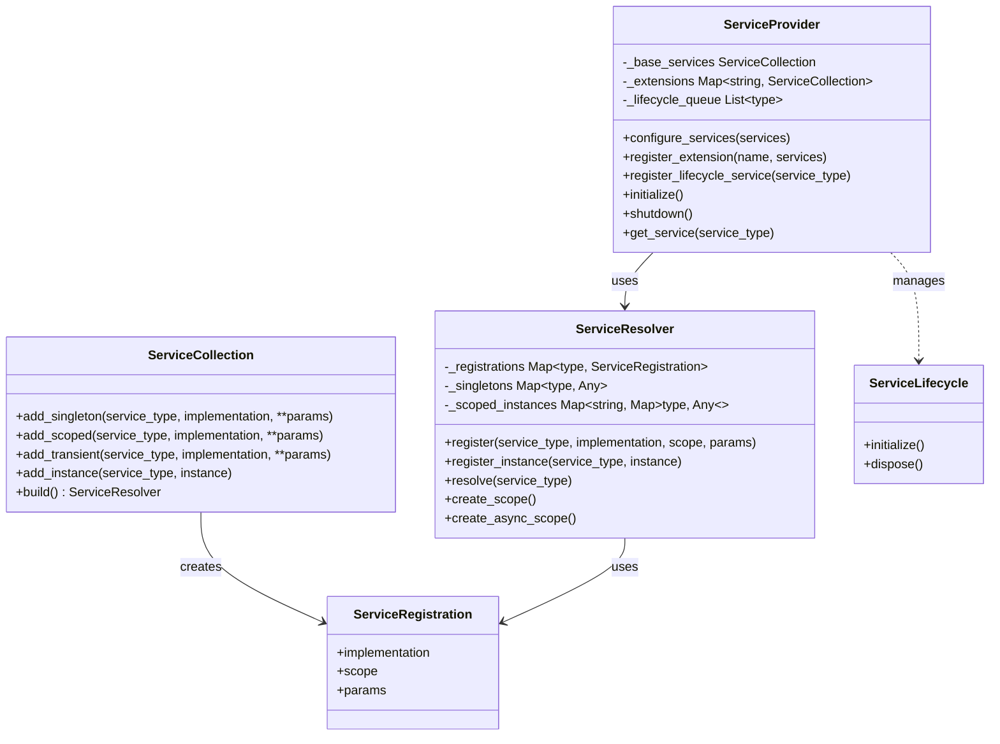
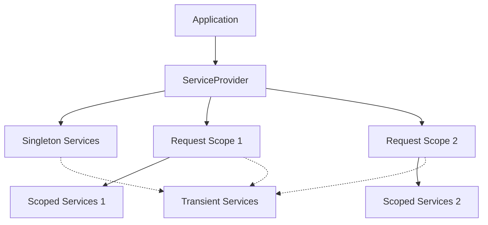

# Uno Framework Dependency Injection System

The Uno Framework provides a modern, hierarchical dependency injection (DI) system designed to improve maintainability, testability, and architectural cleanliness. This document explains how to use and extend the DI system in your applications.

## Overview

The dependency injection system in Uno Framework provides:

- Automatic dependency resolution
- Proper lifecycle management
- Support for both synchronous and asynchronous operations
- Hierarchical service scopes
- Protocol-based interface resolution
- Service discovery and auto-registration

## Key Features

* **Loose Coupling**: Reduce dependencies between components and make your code more modular and testable
* **Inversion of Control**: Let the container manage object creation and lifetime
* **Automatic Dependency Resolution**: Dependencies are automatically injected based on type hints
* **Lifecycle Management**: Proper initialization and disposal of resources
* **Protocol-Based Interfaces**: Use Python's Protocol classes for interface-based programming
* **Service Discovery**: Automatic registration through decorators and package scanning

## Architecture

The Uno DI system consists of the following key components:

### Core Components

* **ServiceCollection**: A fluent API for configuring service registrations
* **ServiceResolver**: The core resolution engine that manages service instances and dependencies
* **ServiceProvider**: A global access point and lifecycle manager for services
* **ServiceRegistration**: Configuration for how a service should be resolved
* **ServiceLifecycle**: Interface for services that need custom initialization and disposal

### Architecture Diagram



## Terminology Note

> **Note:** In this documentation, the term "service" refers to any class or object managed by the dependency injection (DI) container, such as repositories, loggers, or domain services. This usage is standard in DI frameworks. In contrast, in Domain-Driven Design (DDD), a "domain service" is a specific pattern for encapsulating domain logic that doesn't naturally fit within an Entity or Value Object. If you are building DDD-style applications, be mindful of this distinction: "service" in the DI context is a broader term and may include both domain and infrastructure-level components.

## Service Lifetime Scopes

The DI system supports three service lifetime scopes:

- **Singleton**: One instance per container, shared across the application
- **Scoped**: One instance per scope (e.g., per request), created when first requested in a scope
- **Transient**: New instance each time the service is resolved



## Basic Usage

### Registering Services

```python
from uno.core.di import ServiceCollection, get_service_provider

# Create a service collection
services = ServiceCollection()

# Register services with different lifetimes
services.add_singleton(Logger, ConsoleLogger)
services.add_scoped(DatabaseConnection, PostgresConnection) 
services.add_transient(EmailSender)

# Register with constructor parameters
services.add_singleton(
    ConfigService, 
    config_path="settings.json", 
    environment="production"
)

# Register an existing instance
logger = ConsoleLogger()
services.add_instance(Logger, logger)

# Configure the service provider
provider = get_service_provider()
provider.configure_services(services)
```

### Configuring the Service Provider

```python
from uno.core.di import get_service_provider, initialize_services

# Configure base services
provider = get_service_provider()
provider.configure_services(services)

# Register an extension (optional)
feature_services = ServiceCollection()
feature_services.add_singleton(FeatureService)
provider.register_extension("myfeature", feature_services)

# Initialize all services
await initialize_services()
```

### Resolving Services

```python
# Get the service provider
provider = get_service_provider()

# Resolve a service
logger = provider.get_service(Logger)
logger.info("Application started")

# Using scoped services
resolver = provider.get_service(ServiceResolver)
with resolver.create_scope() as scope:
    # Resolve scoped services
    db = scope.resolve(DatabaseConnection)
    users = db.query("SELECT * FROM users")
    
    # Nested dependencies are automatically resolved
    user_service = scope.resolve(UserService)  # UserService depends on DatabaseConnection
```

### Using Async Scopes

```python
# For async contexts
async with resolver.create_async_scope() as scope:
    db = scope.resolve(DatabaseConnection)
    results = await db.execute_query("SELECT * FROM users")
    # Async disposal will happen automatically
```

## Advanced Features

### Automatic Dependency Resolution

The DI system automatically resolves dependencies based on constructor parameter types:

```python
class UserService:
    def __init__(self, db: DatabaseConnection, logger: Logger):
        self.db = db
        self.logger = logger

# No need to manually resolve dependencies
services.add_singleton(UserService)
user_service = provider.get_service(UserService)
# Both db and logger are automatically injected
```

### Service Discovery

The DI system includes automatic service discovery through decorators:

```python
from uno.core.di.decorators import framework_service
from uno.core.di.container import ServiceScope

@framework_service(scope=ServiceScope.SINGLETON)
class UserRepository:
    def __init__(self, db_provider: DatabaseProviderProtocol):
        self.db_provider = db_provider
        
# Or specify a different service type (interface)
@framework_service(service_type=RepositoryProtocol, scope=ServiceScope.SCOPED)
class ProductRepository:
    # ...
```

Discover and register services from a package:

```python
from uno.core.di.discovery import register_services_in_package

# Discover and register services from a package
register_services_in_package("myapp.features", provider)
```

### Service Lifecycle Management

For services that need custom initialization and disposal:

```python
from uno.core.di.provider import ServiceLifecycle

class DatabaseService(ServiceLifecycle):
    def __init__(self, config: ConfigProtocol):
        self.config = config
        self.pool = None
        
    async def initialize(self) -> None:
        # Set up connections, initialize resources
        connection_string = self.config.get_value("DATABASE_URL")
        self.pool = await create_connection_pool(connection_string)
        
    async def dispose(self) -> None:
        # Clean up resources
        if self.pool:
            await self.pool.close()

# Register as a lifecycle service
provider = get_service_provider()
provider.register_lifecycle_service(DatabaseService)
```

### Protocol-Based Dependency Injection

Use Protocol classes to define service interfaces:

```python
from typing import Protocol, Any, Generic, TypeVar

ModelT = TypeVar('ModelT')

class ConfigProtocol(Protocol):
    def get_value(self, key: str, default: Any = None) -> Any: ...
    def all(self) -> dict[str, Any]: ...

class RepositoryProtocol(Protocol, Generic[ModelT]):
    async def get(self, id: str) -> ModelT | None: ...
    async def list(self) -> list[ModelT]: ...
    # ...

# Register implementation
services.add_singleton(ConfigProtocol, UnoConfig)

# Resolve using the protocol
config = provider.get_service(ConfigProtocol)
```

### Factory Registration

For complex object creation or when you need more control over instantiation:

```python
services.add_factory(ComplexObject, lambda service_provider: ComplexObject(
    dependency1=service_provider.resolve(Dependency1),
    dependency2=service_provider.resolve(Dependency2),
    config_value="some_value"
))
```

### Conditional Registration

Register different implementations based on environment or configuration:

```python
if app_config.environment == "production":
    services.add_singleton(EmailService, ProductionEmailService)
else:
    services.add_singleton(EmailService, DevelopmentEmailService)
```

### Lazy Resolution

When you want to defer service instantiation until actually needed:

```python
# Get a lazy reference
lazy_service = provider.get_service_lazy(ExpensiveService)

# Later in the code
if condition:
    actual_service = lazy_service.value  # Only resolved when accessed
```

## Application Startup and Shutdown

```python
from uno.core.di import initialize_services, shutdown_services

async def startup():
    # Initialize all services
    await initialize_services()
    
async def shutdown():
    # Properly dispose all services
    await shutdown_services()
```

## Best Practices

1. **Register by Interface**: Always register services by their interface (Protocol), not their implementation
2. **Minimize Service Scope**: Use the narrowest scope necessary for your services
3. **Implement Lifecycle Hooks**: Use ServiceLifecycle for proper resource management
4. **Avoid Service Locator Pattern**: Inject dependencies directly rather than resolving them inside methods
5. **Keep Services Focused**: Each service should have a single responsibility
6. **Use Decorators**: Leverage the @framework_service decorator for automatic registration
7. **Proper Disposal**: Always dispose of scoped services by using context managers

## Troubleshooting

### Circular Dependencies

The DI system will detect circular dependencies at runtime. To resolve:

1. Refactor your services to break the circular dependency
2. Use factory methods to defer one side of the dependency
3. Use event-based communication between the services

### Missing Dependencies

If you get a `DependencyResolutionError`, check:

1. That all required services are registered
2. That implementations correctly implement their interfaces
3. That you're resolving from the correct scope

## API Reference

### ServiceCollection

- `add_singleton(service_type, implementation_type=None, **params)`
- `add_scoped(service_type, implementation_type=None, **params)`
- `add_transient(service_type, implementation_type=None, **params)`
- `add_instance(service_type, instance)`
- `add_factory(service_type, factory_func)`
- `build() -> ServiceResolver`

### ServiceProvider

- `configure_services(services: ServiceCollection)`
- `register_extension(name: str, services: ServiceCollection)`
- `register_lifecycle_service(service_type: Type)`
- `get_service(service_type: Type) -> Any`
- `get_service_lazy(service_type: Type) -> LazyService`
- `initialize() -> None`
- `shutdown() -> None`

### ServiceResolver

- `register(service_type, implementation, scope, params)`
- `register_instance(service_type, instance)`
- `resolve(service_type)`
- `create_scope() -> ServiceScope`
- `create_async_scope() -> AsyncServiceScope`

### ServiceScope

- `resolve(service_type: Type) -> Any`
- `dispose() -> None`

### AsyncServiceScope

- `resolve(service_type: Type) -> Any`
- `dispose_async() -> Awaitable[None]`

## See Also

- [DI Components Reference](components.md) - Detailed reference for all DI components
- [DI Best Practices](best-practices.md) - Guidelines for effective use of the DI system
